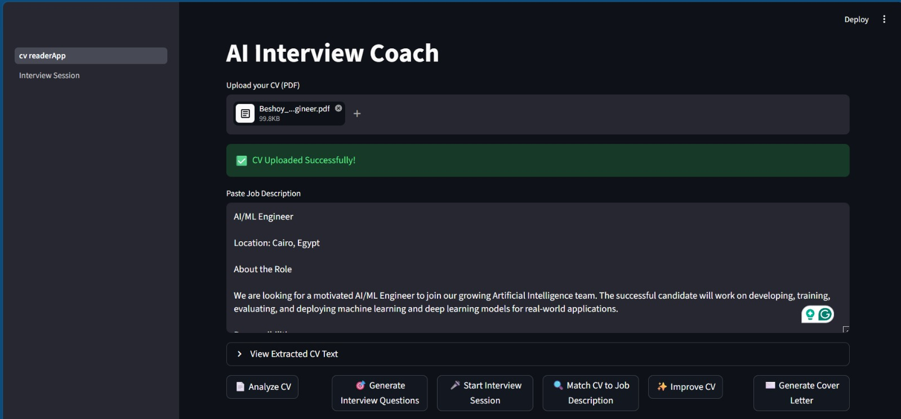
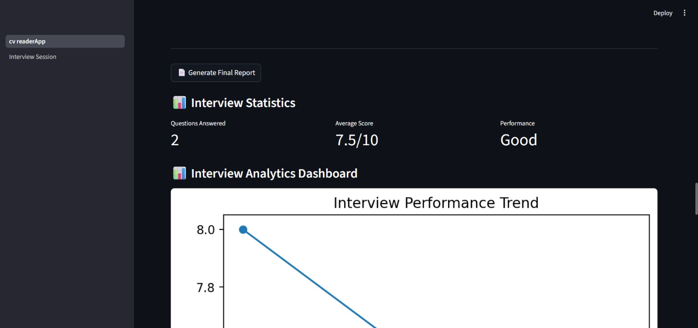

# AI Interview Coach

AI Interview Coach is an AI-powered platform that helps candidates analyze their resumes, improve ATS scores, prepare for interviews, generate tailored cover letters, and receive personalized career guidance using Large Language Models (LLMs).

---

## 🚀 Key Highlights

* CV Analysis & Optimization
* ATS Score Evaluation
* Job Description Matching
* AI Cover Letter Generation
* AI Resume Rewriting
* Voice-Based Interview Simulation
* Whisper Speech-to-Text
* AI Answer Evaluation
* Personalized Learning Roadmap
* Interview Analytics Dashboard
* PDF Report Generation

---

## 📸 Screenshots

### Home Page



### CV Analysis


### ATS Score Analysis


### Job Description Matching


### Interview Question Generation


### Cover Letter Generator


### CV Rewriter


### Live Interview Session


### Interview Session Page


### Interview Analytics Dashboard



### AI Interview Insights


---

## ✨ Features

### CV Analysis

* Extracts text from PDF resumes.
* Identifies strengths and weaknesses.
* Provides actionable improvement suggestions.

### ATS Score Analysis

* Calculates ATS compatibility.
* Detects matched keywords.
* Highlights missing skills and technologies.

### Job Description Matching

* Compares resumes against target job descriptions.
* Generates recruiter-style assessments.
* Produces match scores and recommendations.

### AI Resume Rewriter

* Rewrites CV sections to better match job requirements.
* Improves ATS compatibility.
* Preserves factual candidate information.

### Cover Letter Generator

* Creates personalized cover letters.
* Highlights relevant skills, projects, and achievements.

### AI Interview Question Generator

* Generates technical questions.
* Generates behavioral questions.
* Tailors questions to both the CV and target role.

### Interview Session

* Text-based interview mode.
* Voice-based interview mode.

### Speech-to-Text

* Converts recorded answers into text using Whisper.

### AI Answer Evaluation

* Scores interview answers.
* Provides detailed feedback and recommendations.

### Interview Analytics Dashboard

* Tracks interview performance.
* Displays score trends.
* Shows highest, lowest, and average scores.

### AI Interview Insights

* Identifies strengths.
* Highlights weaknesses.
* Suggests skills to improve.
* Generates final recommendations.

### Learning Roadmap

* Creates a personalized learning plan.
* Recommends next learning steps.

### Final Interview Report

* Generates a complete interview report.
* Supports PDF export.

---

## 🛠️ Tech Stack

### Frontend

* Streamlit

### AI & Machine Learning

* Ollama
* Qwen 3
* Whisper

### Data Processing

* Pandas
* NumPy
* PDFPlumber

### Visualization

* Matplotlib

### Reporting

* ReportLab

---

## 📂 Project Structure

```text
AI-Interview-Coach/
│
├── pages/
│   └── 1_Interview_Session.py
│
├── utils/
│   ├── ats_score.py
│   ├── cover_letter.py
│   ├── cv_analyzer.py
│   ├── cv_rewriter.py
│   ├── evaluator.py
│   ├── interview_analytics.py
│   ├── job_matcher.py
│   ├── learning_roadmap.py
│   ├── ollama_client.py
│   ├── question_generator.py
│   ├── report_generator.py
│   └── ...
│
├── ScreenShots/
├── cv_readerApp.py
├── requirements.txt
└── README.md
```

---

## ⚙️ Installation

### Clone Repository

```bash
git clone https://github.com/Beshoy-Nagy/AI-Interview-Coach.git

cd AI-Interview-Coach
```

### Install Dependencies

```bash
pip install -r requirements.txt
```

### Install Ollama

Download Ollama:

https://ollama.com

Pull the required model:

```bash
ollama pull qwen3:4b
```

### Run the Application

```bash
streamlit run cv_readerApp.py
```

---

## 🔮 Future Improvements

* RAG-Based Resume Analysis
* Vector Database Integration
* Multi-LLM Support
* Interview Video Analysis
* Online Deployment
* Authentication System

---

## 📸 Screenshots

### Home Page


### ATS Score Analysis


### Interview Session


### Interview Analytics Dashboard


### AI Interview Insights


## 👨‍💻 Author

**Beshoy Nagy**

AI Engineer

Faculty of Computers and Artificial Intelligence, Benha University

